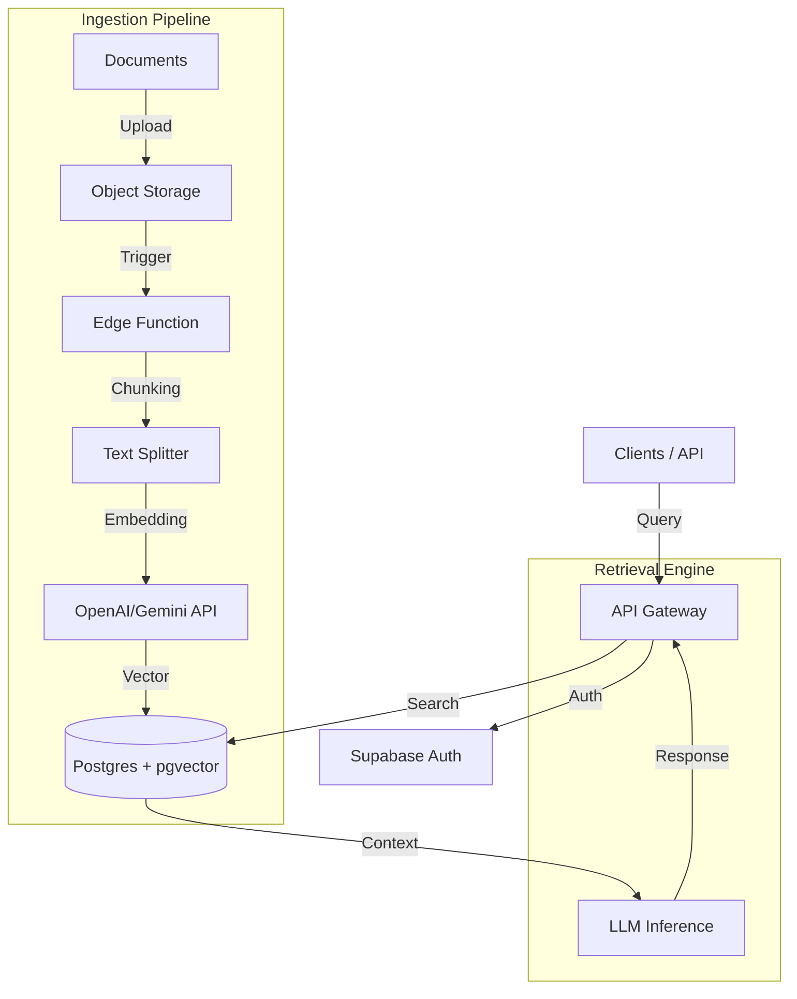

# 🧠 DocuBrain RAG Platform


**DocuBrain** is an enterprise-grade **Semantic Search & RAG (Retrieval-Augmented Generation)** platform designed for high-scale document analysis. It bridges the gap between raw data and LLM intelligence, offering a visual interface to manage vector embeddings, ingestion pipelines, and AI interactions.

## 🏗️ System Architecture

The system follows a modern **Event-Driven Architecture** powered by Supabase and Vector Stores.



## 🚀 Key Features

- **Visual Schema Designer:** Drag-and-drop interface to model your RAG knowledge base.
- **Multi-Model Support:** Plug-and-play with OpenAI GPT-4, Gemini 1.5, or Claude 3.5.
- **Vector Management:** Built-in HNSW index optimization for sub-millisecond search at scale.
- **Role-Based Access Control (RBAC):** Granular permissions for datasets and teams.
- **Real-time Playground:** Test your prompts and retrieval accuracy instantly.

## 🛠️ Tech Stack

- **Frontend:** React 19, TypeScript, Tailwind CSS, Framer Motion
- **Backend:** Supabase (PostgreSQL, Edge Functions, Auth)
- **AI Engine:** LangChain, Google Generative AI
- **DevOps:** Docker, GitHub Actions, Vitest

## 📦 Getting Started

### Prerequisites

- Node.js v20+
- Docker (optional)
- Supabase Project

### Installation

1.  Clone the repository:

    ```bash
    git clone https://github.com/MatheusOBS/Plataforma-DocuBrain-RAG.git
    ```

2.  Install dependencies:

    ```bash
    npm install
    ```

3.  Configure environment:

    ```bash
    cp .env.example .env.local
    # Fill in your VITE_SUPABASE_URL and API Keys
    ```

4.  Run locally:
    ```bash
    npm run dev
    ```

### Docker Deployment

Run the production build with a single command:

```bash
docker-compose up -d --build
```

## 🧪 Testing

We use **Vitest** for unit and integration testing.

```bash
npm test
```

## 🤝 Contributing

We welcome contributions! Please see our [CONTRIBUTING.md](CONTRIBUTING.md) for details.

1.  Fork the Project
2.  Create your Feature Branch (`git checkout -b feat/AmazingFeature`)
3.  Commit your Changes (`git commit -m 'feat(core): add some amazing feature'`)
4.  Push to the Branch (`git push origin feat/AmazingFeature`)
5.  Open a Pull Request

## 📄 License

Distributed under the MIT License. See `LICENSE` for more information.

---

Built with ❤️ by [MatheusOBS](https://github.com/MatheusOBS)
